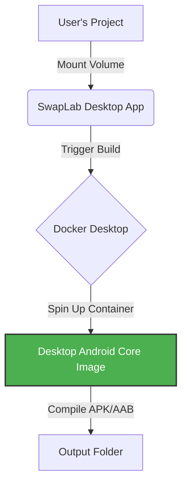

# SwapLab Engine: Desktop Android Core 🐳

> **💸 100% FREE & UNRESTRICTED**
> **No hidden costs. No locked features. No premium tiers.**
> SwapLab Desktop is purely a tool to empower developers.

**The transparent, secure, and immutable build environment powering [SwapLab Desktop](https://desktop.swaplab.net).**

This repository hosts the **public Dockerfile** used to build the core engine for SwapLab Desktop. We believe in total transparency: you should know exactly what tools (Android SDK, Gradle, Java) are compiling your code.

---

## ⚠️ Critical Requirement

> **SwapLab Desktop acts solely as a trigger.** The build process executes entirely inside Docker containers. **SwapLab Desktop will NOT function without Docker Desktop installed and running.**

---

## 🛡️ Architecture: Transparency vs. Logic

To ensure both **Community Trust** (Transparency) and **Operational Integrity** (Security), our architecture is split into two distinct layers. Both are publicly available for use:

| Layer | Image Name | Status | Description |
| :--- | :--- | :--- | :--- |
| **1. Base Core** | `swaplab-engine/desktop-android-core` | **Open Source** (This Repo) | Contains the raw environment: OS, JDK, Android SDK, and Gradle. **Open for security auditing.** You can verify that the environment is clean and standard. |
| **2. Build Engine** | `swaplab-desktop-android-engine` | **Public Package** | This is the final executable image used by the Desktop App. It is built *on top* of this Base Core but includes our **Proprietary Automation Logic** to manage the complex build process seamlessly.  **Official Packages:** 🍎 [View iOS Engine on GHCR](https://github.com/swaplab-engine/desktop-ios-core/pkgs/container/swaplab-desktop-ios-engine) 🤖 [View Android Engine on GHCR](https://github.com/swaplab-engine/desktop-android-core/pkgs/container/swaplab-desktop-android-engine) |

### 🐳 Public Docker Hub Availability

The build engine images are released publicly on Docker Hub. You can verify and download them directly:

1.  **CLI Command:** `docker run swaplab/swaplab-desktop-android-engine:v1.0.0`
2.  **Via Docker Desktop App:**
    You can easily find these images using the Docker Desktop GUI:
    * Open the **Docker Desktop** app.
    * In the search bar, type `swaplab`.
    * You will see **`swaplab/swaplab-desktop-android-engine:v1.0.0`** and **`swaplab/swaplab-desktop-ios-engine:v1.0.0`**.
    * Simply click the **Pull** button to download them manually if desired.

---

## 🚀 Why SwapLab Desktop?

Building Android apps usually requires hours of setting up Java, Gradle, Android Studio, Environment Variables, and dealing with conflicting CLI versions. **SwapLab eliminates all of that.**

SwapLab Desktop is a lightweight (~10MB) GUI controller that triggers this Docker Engine to perform complex builds in **seconds**, not minutes.

### ✨ Key Features

* **🚫 NO CLI / NO Config:** Forget `cordova requirements`, `JAVA_HOME`, or `ANDROID_HOME` errors. It just works out of the box.
* **🔒 100% Privacy & Control:**
    * **No Sign-In Required:** We don't ask for your email or personal data.
    * **No Data Collection:** Your source code **NEVER** leaves your machine.
    * **Local Execution:** Everything runs locally on your localhost.
* **⚡ Blazing Fast:** Leveraging aggressive caching strategies (Gradle & NPM), subsequent builds take seconds.
* **🌐 Offline Capable:** Once the engine image is downloaded, you can build apps without an internet connection.
* **🛡️ Isolated Environment:** Builds run inside ephemeral Docker containers. Your host OS remains clean and uncluttered.

---

## 🎨 Build Anything, From Anywhere

**Compatible with any framework that exports web assets (HTML/CSS/JS).**
If it runs in a browser, SwapLab can turn it into a native app.

> 🧪 **Want to test it now?** Clone our ready-to-use samples:
> [**https://github.com/swaplab-engine/desktop-simple-project**](https://github.com/swaplab-engine/desktop-simple-project)

| Game Engines | Modern Web | UI & Classic |
| :--- | :--- | :--- |
| 🎮 **Construct 3** | ⚛️ **React** | 📱 **Ionic** |
| 🎮 **Construct 2** | 🟢 **Vue / Vuetify** | 🎨 **Framework7** |
| | 🅰️ **Angular** | ⚡ **Alpine.js** |
| | ▲ **Next.js** | 📦 **Vanilla JS** |
| | 🟠 **Svelte / Preact** | 💎 **Stencil** |
| | 🟦 **SolidJS** | 🅱️ **Bootstrap** |
| | 🚀 **Astro / Remix** | 🐦 **Flutter (Web)** |

---

## 🛠️ Workflow Architecture

SwapLab Desktop acts as a secure **trigger**. It orchestrates a fleeting Docker container using our engine to compile your code without polluting your system.

1.  **Inheritance:** The engine inherits this transparent public core.
2.  **Automation:** Our internal logic orchestrates the Gradle build process automatically.
3.  **Result:** A fully compiled, signed APK or AAB file ready for the Play Store.

---

## 📦 What's Inside This Core?

This image is optimized strictly for **Android builds**. It is stripped of unnecessary bloat (like Ruby/CocoaPods) to ensure maximum speed and security.

| Component | Version | Description |
| :--- | :--- | :--- |
| **OS** | Ubuntu 22.04 LTS | Stable Linux Foundation |
| **Android SDK** | API Level 35 | Latest Build Tools (35.0.0) |
| **Gradle** | v8.11.1 | High-performance build automation |
| **Node.js** | v20 (LTS) | JavaScript Runtime |
| **Java** | OpenJDK 21 | Required for modern Android builds |
| **xml2js / plist** | Latest | **Cordova Plugin Hook Dependencies** |
| **Security** | Trivy | Embedded vulnerability scanner |

> **Note:** This image does **NOT** contain Ruby or CocoaPods. For iOS preparation, we use a separate [iOS Core](https://github.com/swaplab-engine/desktop-ios-core).

---

## 📥 Getting Started

### 1. Install Docker Desktop (Required)
SwapLab requires a Docker Engine to run this core.
* **Mac:** [Install Docker for Mac](https://docs.docker.com/desktop/setup/install/mac-install/)
* **Windows:** [Install Docker for Windows](https://docs.docker.com/desktop/setup/install/windows-install/)

> **💡 Pro Tip:** You do **NOT** need to sign in to Docker Desktop. You can simply **skip the login step**. Just ensure the Docker Engine status is **"Running"**.

### 2. Download SwapLab Desktop
Get the lightweight controller for your OS.
* **Download:** [desktop.swaplab.net](https://desktop.swaplab.net)
* **Size:** ~10 MB

### 3. Build Your App
Open SwapLab Desktop, select your project folder, and hit **Start Process**.

---

## 🔍 Transparency Verification

We open-source this Dockerfile so you can verify that **no malicious scripts** or **backdoors** exist in our build environment.

### Manual Verification (Optional)
If you are a power user, you can inspect the image manually using your terminal:

~~~bash
# Pull the public base image
docker pull ghcr.io/swaplab-engine/desktop-android-core:latest

# Enter the container shell
docker run -it --rm ghcr.io/swaplab-engine/desktop-android-core:latest bash

# Check versions
java -version
gradle -v
# Note: This container only holds the tools. It does not contain the automation logic.
~~~

---

## ☁️ Cloud vs. Desktop

| Feature | SwapLab Cloud | **SwapLab Desktop (This)** |
| :--- | :---: | :---: |
| **Infrastructure** | Our High-Spec Servers | Your Local Machine (Docker) |
| **Setup** | Zero (Web Browser) | Minimal (Install Docker) |
| **Privacy** | Secure Upload & Delete | **100% Local / Offline** |
| **Control** | Managed | **Full Control** |
| **Sign-In** | Required | **No Sign-In** |
| **Link** | [swaplab.net](https://swaplab.net) | [desktop.swaplab.net](https://desktop.swaplab.net) |

---

**SwapLab** — *Build Native Apps. Simply.*